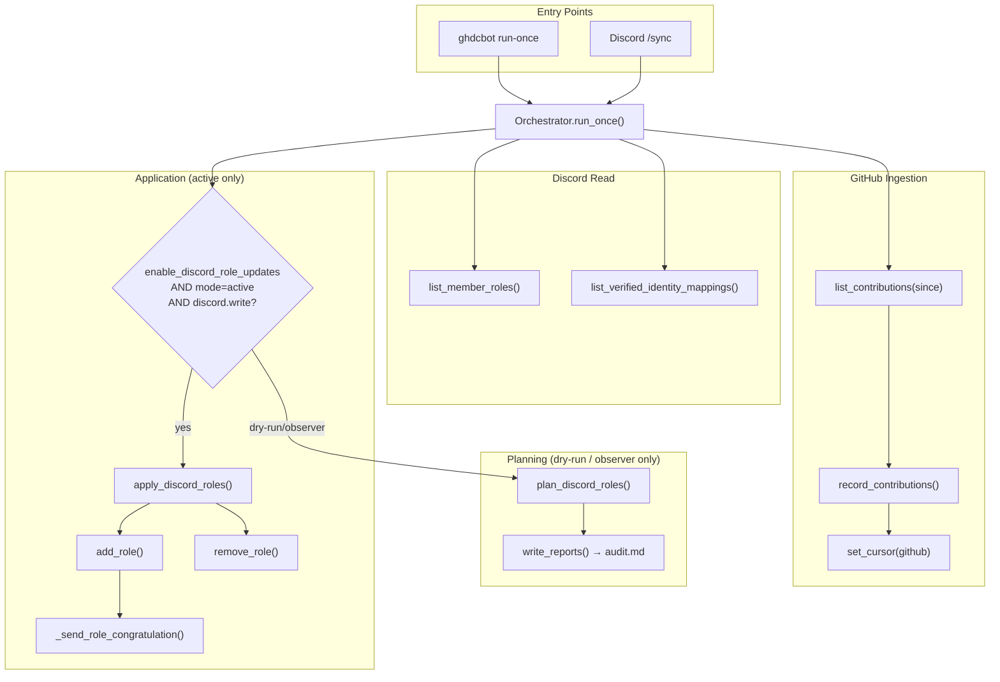
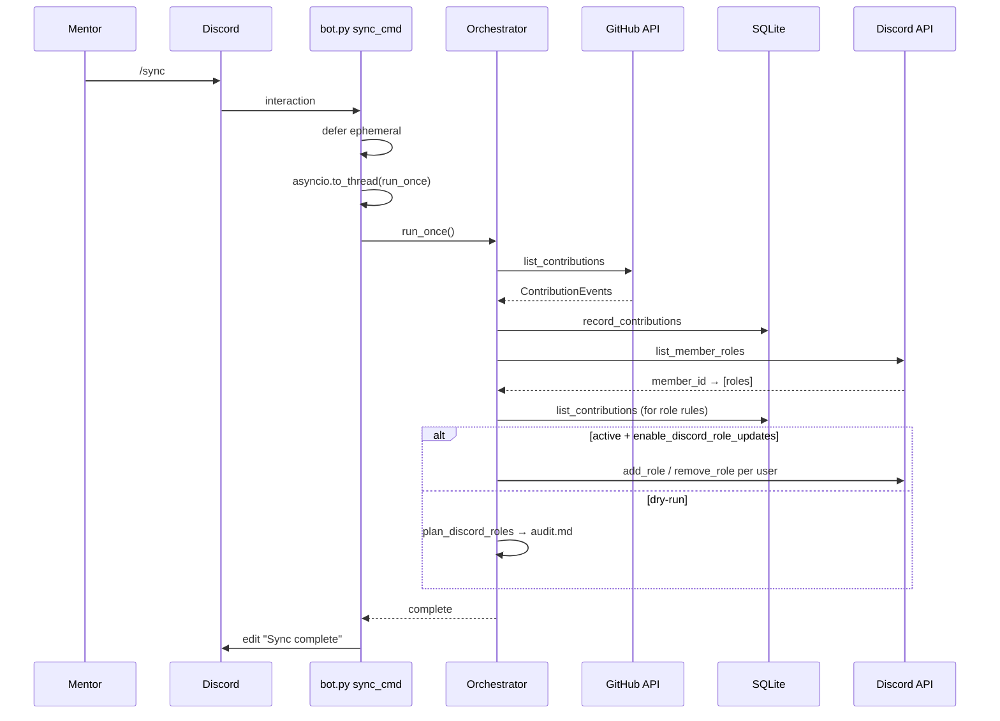
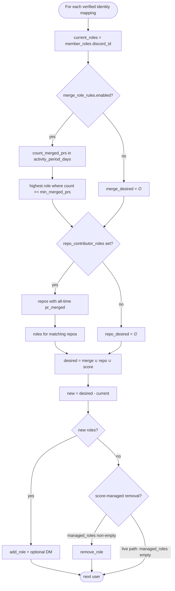
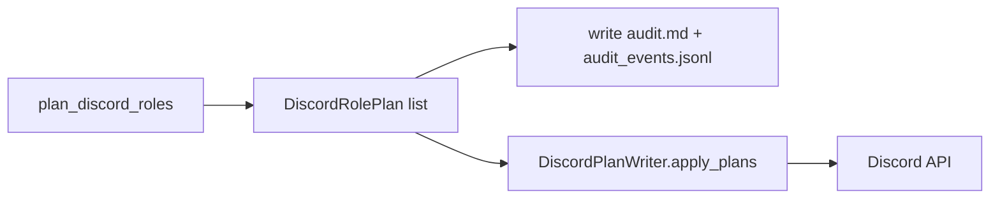

# Role Assignment Flow — Technical Reference

Week 6 investigation artifact. Describes the complete role assignment lifecycle as implemented in the current repository.

---

## 1. High-Level Lifecycle



---

## 2. Command Flow (`/sync`)



**Files:** `src/ghdcbot/bot.py` (`sync_cmd`), `src/ghdcbot/engine/orchestrator.py`

---

## 3. Role Update Flow (rule evaluation)



**Planning path:** `plan_discord_roles()` in `planning.py`  
**Apply path:** `apply_discord_roles()` in `orchestrator.py` (parallel implementation)

---

## 4. Event Flow (GitHub → Role)

```text
GitHub: PR merged
    │
    ▼
rest.py: _collect_pull_request_events()
    │  event_type = "pr_merged"
    ▼
orchestrator: record_contributions()
    │
    ▼
sqlite: contributions table
    │
    ▼ (next run-once or same run, after record)
planning: count_merged_prs_per_user(period_start, period_end)
planning: repos_with_merged_pr_per_user(all-time)
    │
    ▼
apply_discord_roles: threshold check
    │
    ▼
Discord: PUT /members/{id}/roles/{role_id}
```

**Note:** Other events (`pr_opened`, `comment`, `pr_reviewed`) are stored but **not** consumed by role assignment today.

---

## 5. ASCII — Full Sync Pipeline

```text
┌─────────────────────────────────────────────────────────────────┐
│                        run_once / /sync                          │
└───────────────────────────────┬─────────────────────────────────┘
                                │
        ┌───────────────────────┼───────────────────────┐
        ▼                       ▼                       ▼
 ┌─────────────┐        ┌─────────────┐        ┌─────────────┐
 │ GitHub      │        │ SQLite      │        │ Discord     │
 │ ingest      │───────►│ contributions│◄──────│ list_member │
 │ pr_merged…  │        │ cursors     │        │ _roles      │
 └─────────────┘        └──────┬──────┘        └──────┬──────┘
                               │                      │
                               └──────────┬───────────┘
                                          ▼
                               ┌─────────────────────┐
                               │ identity_mappings   │
                               │ (verified links)    │
                               └──────────┬──────────┘
                                          │
                    ┌─────────────────────┴─────────────────────┐
                    ▼                                           ▼
           ┌────────────────┐                        ┌────────────────┐
           │ DRY_RUN/       │                        │ ACTIVE +       │
           │ OBSERVER       │                        │ enable_updates │
           └───────┬────────┘                        └───────┬────────┘
                   ▼                                         ▼
           plan_discord_roles                          apply_discord_roles
                   │                                         │
                   ▼                                         ▼
           audit.md / audit.json                      add_role / remove_role
```

---

## 6. Active vs Passive Mode

| Mode | `runtime.mode` | Discord writes | Role behavior |
|------|----------------|----------------|---------------|
| Passive audit | `dry-run` | Blocked | `plan_discord_roles` → reports only |
| Passive read | `observer` | Blocked | Same as dry-run |
| Active | `active` | If `discord.permissions.write` | `apply_discord_roles` → API calls |
| Active (safe) | `active` + `enable_discord_role_updates: false` | Blocked | Ingest + notify only; **no role changes** |

---

## 7. File Dependency Map

```text
cli.py / bot.py
    └── orchestrator.py
            ├── adapters/github/rest.py          (ingest pr_merged)
            ├── adapters/storage/sqlite.py       (persist + query)
            ├── adapters/discord/api.py          (read/apply roles)
            ├── engine/planning.py               (plan_discord_roles)
            ├── engine/reporting.py              (audit.md)
            ├── engine/snapshots.py              (roles.json export)
            ├── config/models.py                 (merge_role_rules, repo_contributor_roles)
            └── core/modes.py                    (MutationPolicy)

NOT in live apply path:
    adapters/discord/writer.py (DiscordPlanWriter) — tests only
    engine/planning.py::plan_merge_based_roles() — dead code
```

---

## 8. Role Rule Decision Matrix

| Rule source | Config key | Add | Remove | Data window |
|-------------|------------|-----|--------|-------------|
| Score threshold | `role_mappings` | Plan only | Plan only | N/A (unwired) |
| Merge count | `merge_role_rules` | Yes | **Never** | `activity_period_days` |
| Repo merge | `repo_contributor_roles` | Yes | **Never** | All-time in DB |
| Active contributor | — | **Not implemented** | — | — |

---

## 9. Discord API Call Map

| Operation | Method | Endpoint | Called from |
|-----------|--------|----------|-------------|
| List roles | GET | `/guilds/{guild}/roles` | `api.py` `_list_roles` |
| List members | GET | `/guilds/{guild}/members` | `api.py` `_list_members` |
| Add role | PUT | `/guilds/{guild}/members/{user}/roles/{role}` | `api.py` `add_role` |
| Remove role | DELETE | same | `api.py` `remove_role` |

---

## 10. Gating Checklist (all required for live role mutation)

```text
[ ] runtime.mode == "active"
[ ] runtime.enable_discord_role_updates == true
[ ] discord.permissions.write == true
[ ] User in list_verified_identity_mappings()
[ ] Target role exists in guild (name match)
[ ] Bot role position > target role
[ ] Bot has Manage Roles permission
```

---

## 11. Proposed Target Flow (Week 6 — not implemented)



This consolidates today's duplicated plan/apply logic into one deterministic path.
