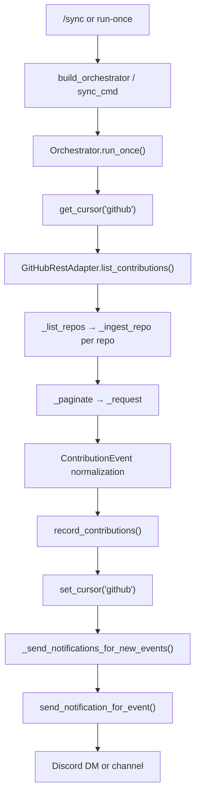

# Week 3 Notes — Ingestion Flow & Implementation Map

> Investigation only. No production code changes in this document.

---

## Goal 1: Complete Ingestion Flow

### Flow diagram

```text
┌─────────────────────────────────────────────────────────────────────────────┐
│ ENTRY POINTS                                                                │
├─────────────────────────────────────────────────────────────────────────────┤
│  CLI: ghdcbot --config <yaml> run-once                                      │
│    → cli.py:main() → build_orchestrator() → orchestrator.run_once()         │
│                                                                             │
│  Discord: /sync (mentor-only)                                               │
│    → bot.py:sync_cmd() → Orchestrator(...) → asyncio.to_thread(run_once)  │
└─────────────────────────────────────────────────────────────────────────────┘
                                    │
                                    ▼
┌─────────────────────────────────────────────────────────────────────────────┐
│ Orchestrator.run_once()          [engine/orchestrator.py]                   │
├─────────────────────────────────────────────────────────────────────────────┤
│  1. storage.init_schema()                                                   │
│  2. prior_cursor = storage.get_cursor("github") or period_start             │
│  3. contributions = list(github_reader.list_contributions(prior_cursor))    │
│  4. storage.record_contributions(contributions)                             │
│  5. storage.set_cursor("github", max(created_at)) if advanced               │
│  6. scoring, assignment planning, role plans, reports, mutations, snapshots │
│  7. _send_notifications_for_new_events(contributions, ...)                │
└─────────────────────────────────────────────────────────────────────────────┘
                                    │
                                    ▼
┌─────────────────────────────────────────────────────────────────────────────┐
│ GitHubRestAdapter.list_contributions(since)  [adapters/github/rest.py]     │
├─────────────────────────────────────────────────────────────────────────────┤
│  _list_repos()                                                              │
│    → GET /orgs/{org}/repos (paginated)                                      │
│    → optional fallback: GET /user/repos on 401/403                          │
│    → _apply_repo_filter()                                                   │
│  for each repo: _ingest_repo(repo, since)                                   │
│    → _collect_issue_events()      → issue_opened, issue_closed, assigned    │
│    → _collect_pull_request_events() → pr_opened, pr_merged, pr_reverted, …  │
│    → _ingest_issue_comments()     → comment                                 │
│    → _ingest_pr_comments()        → comment                                 │
│    → _ingest_helpful_comments()   → helpful_comment                         │
│    → each collector uses _paginate() → _request() per page                    │
└─────────────────────────────────────────────────────────────────────────────┘
                                    │
                                    ▼
┌─────────────────────────────────────────────────────────────────────────────┐
│ PAGINATION                     [rest.py: _paginate, _paginate_from_page]     │
├─────────────────────────────────────────────────────────────────────────────┤
│  page = 1, loop:                                                            │
│    response = _request("GET", path, params={..., "page": page})             │
│    stop on None / non-200 / empty list / no Link rel="next"                 │
│    yield page data; page += 1                                               │
└─────────────────────────────────────────────────────────────────────────────┘
                                    │
                                    ▼
┌─────────────────────────────────────────────────────────────────────────────┐
│ NORMALIZATION                  [rest.py collectors → core/models.py]        │
├─────────────────────────────────────────────────────────────────────────────┤
│  Raw GitHub JSON → ContributionEvent(                                       │
│    github_user, event_type, repo, created_at, payload                       │
│  )                                                                          │
│  Filters: bot users (_is_bot_user), PR-vs-issue separation, since cutoff    │
└─────────────────────────────────────────────────────────────────────────────┘
                                    │
                                    ▼
┌─────────────────────────────────────────────────────────────────────────────┐
│ SQLITE STORAGE                 [adapters/storage/sqlite.py]                 │
├─────────────────────────────────────────────────────────────────────────────┤
│  record_contributions() → INSERT INTO contributions (no dedupe)             │
│  DB: {data_dir}/state.db                                                    │
└─────────────────────────────────────────────────────────────────────────────┘
                                    │
                                    ▼
┌─────────────────────────────────────────────────────────────────────────────┐
│ CURSOR UPDATE                  [sqlite.py + orchestrator.py]                │
├─────────────────────────────────────────────────────────────────────────────┤
│  Table: cursors (source, cursor)                                            │
│  Key: "github"                                                              │
│  Read: get_cursor("github") — None → defaults to period_start (not epoch)   │
│  Write: set_cursor("github", max(event.created_at)) only if > prior_cursor  │
│  Empty fetch: cursor unchanged                                              │
└─────────────────────────────────────────────────────────────────────────────┘
                                    │
                                    ▼
┌─────────────────────────────────────────────────────────────────────────────┐
│ NOTIFICATIONS                  [engine/notifications.py]                    │
├─────────────────────────────────────────────────────────────────────────────┤
│  _send_notifications_for_new_events() filters this run's contributions:     │
│    issue_assigned | pr_reviewed | pr_merged                                 │
│  send_notification_for_event() per event:                                   │
│    config flag check → resolve verified GitHub→Discord → dedupe key         │
│    → build message → DiscordApiAdapter.send_dm / send_message               │
│    → mark notifications_sent + audit event                                  │
└─────────────────────────────────────────────────────────────────────────────┘
```

### Mermaid (optional view)



---

## All Files Involved (by layer)

| Layer | File | Role |
|-------|------|------|
| **Entry — CLI** | `src/ghdcbot/__main__.py` | Delegates to `cli.main()` |
| | `src/ghdcbot/cli.py` | `run-once` subcommand; `build_orchestrator()` |
| **Entry — Discord** | `src/ghdcbot/bot.py` | `/sync` slash command (`sync_cmd`); runs `run_once` in worker thread |
| **Config** | `src/ghdcbot/config/loader.py` | `load_config()`, `get_active_config()` |
| | `src/ghdcbot/config/models.py` | `BotConfig`, `GitHubConfig`, `NotificationConfig`, scoring/assignment |
| **Wiring** | `src/ghdcbot/plugins/registry.py` | `build_adapter()` — dynamic adapter import |
| **Orchestration** | `src/ghdcbot/engine/orchestrator.py` | `Orchestrator.run_once()`, cursor read/write, notification dispatch |
| **GitHub ingestion** | `src/ghdcbot/adapters/github/rest.py` | `list_contributions`, `_paginate`, `_request`, PR/issue collectors |
| **Identity (separate path)** | `src/ghdcbot/adapters/github/identity.py` | Bio/gist verification only — not part of sync ingestion |
| **Storage** | `src/ghdcbot/adapters/storage/sqlite.py` | `record_contributions`, `get_cursor`, `set_cursor`, `notifications_sent` |
| **Interfaces** | `src/ghdcbot/core/interfaces.py` | `GitHubReader`, `Storage` contracts |
| **Models** | `src/ghdcbot/core/models.py` | `ContributionEvent`, `GitHubAssignmentPlan` |
| **Notifications** | `src/ghdcbot/engine/notifications.py` | `send_notification_for_event`, dedupe, CodeRabbit reminders |
| **Discord delivery** | `src/ghdcbot/adapters/discord/api.py` | `send_dm`, `send_message`, Discord `_request` |
| **Scoring (post-ingest)** | `src/ghdcbot/engine/scoring.py` | `WeightedScoreStrategy.compute_scores()` |
| **Assignment (post-ingest)** | `src/ghdcbot/engine/assignment.py` | `RoleBasedAssignmentStrategy` |
| | `src/ghdcbot/engine/planning.py` | Discord role plans from scores |
| **Logging** | `src/ghdcbot/logging/setup.py` | `configure_logging()`, `JsonFormatter` |
| **Tests** | `tests/test_github_ingestion_comments.py` | Ingestion + rate-limit header parsing |
| | `tests/test_notifications.py` | Notification message building |
| | `tests/test_readme_setup.py` | End-to-end `run_once` smoke test |

---

## Goal 2: Week 3 Implementation Status

Implemented symbols: `_execute_request_with_retries()`, `_request()`, `_parse_rate_limit()`, `logging/setup.py` → `configure_logging()`, `SyncSession`, `sync_context.py`.

### Retry handling — before vs after

| Area | Before this PR | After this PR |
|------|----------------|---------------|
| HTTP retry | Single attempt in `_request()` | `_execute_request_with_retries()` — max 4 attempts with backoff + jitter |
| Transient status | 502/503/504 stopped pagination | Retried via `_execute_request_with_retries()` |
| Permission 403 | Returned `None` immediately | Still `None` via `_request()` + `_log_permission_issue()` |
| Direct `_client` calls | No retry | **Still bypass** `_request()` in some mutation helpers (future refactor) |

### Rate-limit handling — before vs after

| Area | Before this PR | After this PR |
|------|----------------|---------------|
| Header parse | `_parse_rate_limit()` warn-only | Same parser; used for sleep-until-reset |
| `403` + `Remaining == 0` | Log + return `None` | Sleep until `X-RateLimit-Reset` in inner loop (`_is_rate_limit_exhausted`, `_rate_limit_sleep_seconds`); capped by `_GITHUB_MAX_RATE_LIMIT_RECOVERIES` |
| Permission `403` | Log + `None` | Unchanged — no sleep/retry |
| Structured logs | None | `github_rate_limit_exhausted`, `github_rate_limit_recovered`, `github_request_retry` |

### Observability — before vs after

| Area | Before this PR | After this PR |
|------|----------------|---------------|
| `JsonFormatter` | Dropped `extra` fields | Preserves all custom fields |
| Sync correlation | None | `sync_id` via `SyncSession` + `SyncContextFilter` |
| Lifecycle logs | None | `github_sync_started` / `completed` / `failed` |
| Per-repo | Generic info logs | `repo_ingestion_started` / `completed` with timing |

### Still open (not in this PR)

| Area | Notes |
|------|-------|
| Pagination partial-ingestion summary | `_paginate()` stops on failure; no repo-level failure rollup yet |
| Per-repo cursors | Single global `"github"` cursor remains |
| Mutation bypass paths | `assign_issue`, CI checks still call `_client` directly |
| `Retry-After` header | Secondary rate limits not handled |

See also: `retry_design.md`, `request_flow.md`, `observability_design.md`.

---

## Goal 4: Rate Limiting — Implemented Behavior

### Before this PR

1. `_request()` logged rate-limit warnings but did **not** sleep on exhaustion.
2. All `403` responses were treated as permission failures.
3. `502/503/504` aborted pagination without retry.

### What changed in this PR

Implemented in `rest.py` via `_execute_request_with_retries()`:

```text
HTTP response
    │
    ├─ Timeout / ConnectionError → retry with backoff (max 4 transient attempts)
    │
    ├─ 502 / 503 / 504 → retry with backoff
    │
    ├─ 403 + X-RateLimit-Remaining == 0
    │     → _is_rate_limit_exhausted()
    │     → _rate_limit_sleep_seconds() / _rate_limit_reset_timestamp()
    │     → _log_github_rate_limit_exhausted → sleep → _log_github_rate_limit_recovered
    │     → retry same request (separate from transient budget; capped at _GITHUB_MAX_RATE_LIMIT_RECOVERIES)
    │     → missing reset → _log_github_rate_limit_missing_reset → return None
    │
    ├─ 403 (permission, Remaining > 0) → _log_permission_issue() → return None via _request()
    │
    ├─ 401 / 404 → return None, no retry
    │
    └─ 200 → continue pagination
```

### Future stretch

GitHub may return `403` with `Retry-After` for abuse/secondary limits (not always `Remaining == 0`). Not implemented yet.

---

## Goal 5: Mentor Discussion Points

Questions for Bhavik / Bruno:

1. **Blocking on rate limit** — Should `/sync` and `run-once` block (sleep) until `X-RateLimit-Reset`, or fail fast and let the operator re-run later?
2. **Acceptable `/sync` duration** — Large orgs can take many minutes today (`bot.py` runs `run_once` in a worker thread for this reason). Is a 5–15 minute sync acceptable if rate-limited?
3. **Partial ingestion** — If repo 3 of 10 fails after retries, should we:
   - advance the global cursor anyway (current risk: skip events),
   - leave cursor unchanged (risk: re-fetch duplicates),
   - or log a warning and surface it in `/sync` response?
4. **Failure visibility** — Warning logs only, or should `/sync` report "synced N/M repos" or fail the command on partial ingestion?
5. **Per-repo cursors** — Is a single global `"github"` cursor sufficient for GSoC scope, or is per-repo cursor management a future requirement?
6. **Duplicate contributions** — `record_contributions()` has no dedupe. Is cursor-only deduplication acceptable, or should we add a unique constraint?
7. **`tenacity` vs custom** — Prefer `tenacity` (already a dependency) or a small inline retry loop in `_request()`?

---

## Known Gaps (observed during trace)

- Duplicate `_send_notifications_for_new_events` definition in `orchestrator.py` (L287–304 stub + L296–333 real impl) — cleanup candidate, not Week 3 scope unless mentors want it.
- Notifications only fire for events ingested **in the current run** — not re-scanned from DB.
- `pr_review_requested` is in config but not in orchestrator's notification filter.
- Some `rest.py` mutation helpers bypass `_request()` entirely.

---

## End-of-Day Checklist

- [x] Complete ingestion flow diagram
- [x] List of files/functions to modify
- [x] Retry strategy document (`retry_design.md`)
- [x] Rate-limit handling design (this file)
- [x] Questions for mentors
- [x] No production code changes
